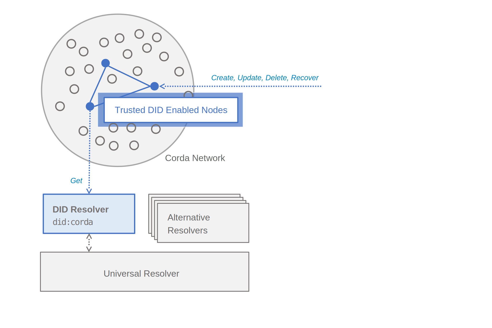

Corda DID Method Proof-of-Concept
=================================

Deliverables
------------

 1. A basic method spec document to be registered with the [DID method registry](https://w3c-ccg.github.io/did-method-registry/#the-registry)
 2. A Universal Resolver "[Driver](https://github.com/decentralized-identity/universal-resolver/)" using the `Corda` method
 3. A CorDapp providing an end-point implementing the method spec (1) in a way that can be accessed by the resolver (2)

Design-Decisions
----------------

To-Do's
-------
