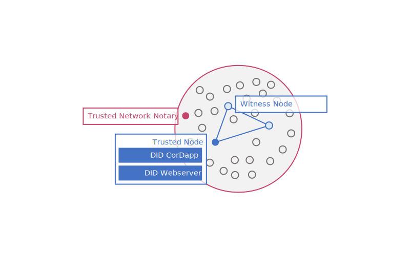

Corda DID Method Proof-of-Concept
=================================
## Table of Contents
1. [Introduction](#introduction)
2. [Specifications](#specifications) 
3. [CorDapp design -CMN views](#cmn)
4. [Setup](#setup)
5. [Caveats](#caveats)
6. [Risks/Known Attack Surface](#risks)
7. [Partnership](#partner)

<a name="introduction"></a>
### Introduction
This repository contains all components necessary to provide a Corda ‘Decentralized Identifier Method’ within the meaning of the [Data Model and Syntaxes for Decentralized Identifiers Draft Community Group Report 06 February 2019](https://w3c-ccg.github.io/did-spec).



The system architecture outlined above illustrates the high level components without going into implementation details.
On a high level, persistence of DID documents will be provided by a _consortium_ of trusted nodes operating within a _network_.
The Corda DID method allows targeting three networks by specification: [The Corda Network](https://corda.network/) (UAT and Live [environments](https://corda.network/policy/environments.html)) as well as [Testnet](https://docs.corda.net/head/corda-testnet-intro.html).

End users that aim to _create_, _read_, _update_ or _delete_ DID documents can do so by interacting with a trusted node of their choosing.
The API provided for interaction is exposing REST endpoints over HTTP, using a JSON based envelope format closely aligned with the JSON-LD examples found in the [draft community report](https://w3c-ccg.github.io/did-spec/#dfn-did-document).

When users interact with consortium member nodes, their requests will be handled by a _web server_ that transforms the requests into a [format suitable for Corda](https://docs.corda.net/clientrpc.html).
The web server component is running in a process independent of Corda.
User calls ‘proxied’ through this way will invoke a [Flow](https://docs.corda.net/key-concepts-flows.html) on one of the consortium nodes.
As part of this flow, consortium nodes will validate that the id provided by the user is valid and that the message has cryptographic integrity (i.e. that the DID document is signed properly).
Once this validation was successful, DID documents will be replicated from the _trusted node_ (i.e. the node the user chose to interact with via REST) to all _witness nodes_ (i.e. all other nodes in the consortium).
Witness nodes will perform a cryptographic integrity check as part of the [contract](https://docs.corda.net/key-concepts-contracts.html) underpinning this transaction.

Once replicated, anyone with access to one of the consortium nodes can request the DID document by querying the REST API of an arbitrary node for the document ID.

<a name="specifications"></a>
## Specifications
### Corda DID Format
----------------

A Corda DID specifies the `corda` method, a target network (currently `testnet`, `tcn-uat`, `tcn`) and a UUID formatted as per [RFC 4122](https://tools.ietf.org/html/rfc4122#section-3).

```regexp
did:corda:(testnet|tcn-uat|tcn):[0-9a-f]{8}\b-[0-9a-f]{4}-[0-9a-f]{4}-[0-9a-f]{4}-\b[0-9a-f]{12}
```

I.e.

 - `did:corda:testnet:3df6b0a1-6b02-4053-8900-8c36b6d35fa1`
 - `did:corda:tcn:3df6b0a1-6b02-4053-8900-8c36b6d35fa1`
 - `did:corda:tcn-uat:3df6b0a1-6b02-4053-8900-8c36b6d35fa1`

### Corda DID-Network Mapping

Initially, consortium membership is envisioned to change rarely so that a fixed set of member nodes can be defined and provided to consortium members.
A more dynamic approach to membership may be developed later.

| ID        | Network                                                         | Stage | Consortium Member Nodes |
|-----------|-----------------------------------------------------------------|-------|-------------------------|
| `testnet` | [Testnet](https://docs.corda.net/head/corda-testnet-intro.html) | --    | --to be defined--       |
| `tcn-uat` | [The Corda Network](https://corda.network/)                     | UAT   | --to be defined--       |
| `tcn`     | [The Corda Network](https://corda.network/)                     | Live  | --to be defined--       |
 
### Corda DID Operation Definition
Corda DID supports CRUD operations. Developers can perform CRUD operations in two ways:
* REST APIs
* Flows

### Corda DID REST APIs ([`did-api`](did-api))

The DID API is the server component to be deployed by consortium member nodes in conjunction with the CorDapp.
It provides Method specific APIs to _create_, _read_, _update_ or _delete_ DID documents.

The Corda DID method achieves proof-of-ownership of a *document* by requiring proof-of-ownership of the *keys* contained in the document.

To implement that, any DID document must be wrapped in an envelope.
This envelope must contain signatures by all private keys associated with the public keys contained in the documents.


Envelopes that do not contain signatures for all public keys will be rejected.
Envelopes using unsupported cryptographic suites or unsupported serialisation mechanisms will be rejected.
In the current implementation there are severe restrictions on which suites and serialisation mechanisms can be used (see _Caveats_ below).

#### API Format

##### Instruction

Instruction data tells the API what to do with the document received.
It also contains proof of ownership of keys.
The instruction data is to be formatted according to the following schema:

```json
{
  "definitions": {},
  "$schema": "http://json-schema.org/draft-07/schema#",
  "type": "object",
  "required": [
    "action",
    "signatures"
  ],
  "properties": {
    "action": {
      "$id": "#/properties/action",
      "type": "string",
      "enum": [
        "create",
        "read",
        "update",
        "delete"
      ]
    },
    "signatures": {
      "$id": "#/properties/signatures",
      "type": "array",
      "items": {
        "$id": "#/properties/signatures/items",
        "type": "object",
        "required": [
          "id",
          "type",
          "signatureBase58"
        ],
        "properties": {
          "id": {
            "$id": "#/properties/signatures/items/properties/id",
            "type": "string",
            "description": "The ID of the public key that is part of the key pair signing the document.",
            "examples": [
              "did:corda:testnet:3df6b0a1-6b02-4053-8900-8c36b6d35fa1#keys-1",
              "did:corda:tcn:3df6b0a1-6b02-4053-8900-8c36b6d35fa1#keys-2"
            ],
            "pattern": "^did:corda:(testnet|tcn-uat|tcn):[0-9a-f]{8}\\b-[0-9a-f]{4}-[0-9a-f]{4}-[0-9a-f]{4}-\\b[0-9a-f]{12}#.+$"
          },
          "type": {
            "$id": "#/properties/signatures/items/properties/type",
            "type": "string",
            "description": "The cryptographic suite this key has been generated with. More formats (RsaSignature2018, EdDsaSASignatureSecp256k1) to follow.",
            "enum": [
              "Ed25519Signature2018"
            ]
          },
          "signatureBase58": {
            "$id": "#/properties/signatures/items/properties/signatureBase58",
            "type": "string",
            "description": "The binary signature in Base58 representation. More formats to follow.",
            "examples": [
              "54CnhKVqE63rMAeM1b8CyQjL4c8teS1DoyTfZnKXRvEEGWK81YA6BAgQHRah4z1VV4aJpd2iRHCrPoNTxGXBBoFw"
            ]
          }
        }
      }
    }
  }
}
```


##### Supported Encoding

| Encoding           | Description            |
|---------------|------------------|
| `signatureHex` | Hex encoded signature. |
| `signatureBase64`    | Base64 encoded signature.         |
| `signatureBase58` | Base58 encoded signature. |
| `signatureMultibase`    | Multibase encoded signature,details [here.](https://github.com/multiformats/multibase)       |

##### Examples:
<br>

###### Base58

```json
{
  "action": "create",
  "signatures": [
    {
      "id": "did:corda:tcn:d51924e1-66bb-4971-ab62-ec4910a1fb98#keys-1",
      "type": "Ed25519Signature2018",
      "signatureBase58": "54CnhKVqE63rMAeM1b8CyQjL4c8teS1DoyTfZnKXRvEEGWK81YA6BAgQHRah4z1VV4aJpd2iRHCrPoNTxGXBBoFw"
    }
  ]
}
```
###### Multibase
```json
{
  "action": "create",
  "signatures": [
	{
	  "id": "did:corda:tcn:84602311-bd95-4006-968c-01a69d035d64#keys-1",
	  "type": "Ed25519Signature2018",
	  "signatureMultibase": "bb3i4jlob2pomlx5yjv5adir7r26tkor6iqroosojkqi4wq2kcjtiju3moxsrkwmobhtlega27uzuxtncks6yib6otqybfykjyzieqe"
	}
  ]
}
```
###### Hex
```json
{
  "action": "create",
  "signatures": [
	{
	  "id": "did:corda:tcn:03d7411f-ae67-4c89-94b8-de802f017745#keys-1",
	  "type": "Ed25519Signature2018",
	  "signatureHex": "04242D453FA6191B67308B9454E08EC2D59524063F53F85D11E43151283DF672959B9F546CD437FACA914DD15D41F7F6B5FF0AA00ABF5EE91826C70EA83F0E03"
	}
  ]
}
```
###### Base64
```json
{
  "action": "create",
  "signatures": [
	{
	  "id": "did:corda:tcn:4b78d87e-1dee-403d-89d6-d2e12926d309#keys-1",
	  "type": "Ed25519Signature2018",
	  "signatureBase64": "Kh39kEoMvzfolBimiT/6wGeTys5Leuk/M0im9CligIpRXsJnIx4STphsofZBnbX198H7AfuVp8IJYyzMwKtaAg=="
	}
  ]
}
```
##### Document

The format of the document follows the [Data Model and Syntaxes for Decentralized Identifiers Draft Community Group Report 06 February 2019](https://w3c-ccg.github.io/did-spec) in JSON-LD.

###### Supported Encoding

| Encoding           | Description            |
|---------------|------------------|
| `publicKeyHex` | Hex encoded public key. |
| `publicKeyBase64`    | Base64 encoded public key.         |
| `publicKeyBase58` | Base58 encoded public key. |
| `publicKeyMultibase`    | Multibase encoded public key,details [here.](https://github.com/multiformats/multibase)       |
| `publicKeyPem` | pem encoded public key. |
| `publicKeyJwk` | JWK encoded public key,details [here](https://tools.ietf.org/html/rfc7517) |
##### Examples:
<br>

###### Base58
```json
{
  "@context": "https://w3id.org/did/v1",
  "id": "did:corda:tcn:2ce7cef6-6948-4d71-a6ab-dbd8096050fb",
  "publicKey": [
	{
	  "id": "did:corda:tcn:2ce7cef6-6948-4d71-a6ab-dbd8096050fb#keys-2",
	  "type": "EcdsaVerificationKeySecp256k1",
	  "controller": "did:corda:tcn:2ce7cef6-6948-4d71-a6ab-dbd8096050fb",
	  "publicKeyBase58": "PZ8Tyr4Nx8MHsRAGMpZmZ6TWY63dXWSCzamP7YTHkZc78MJgqWsAyXmwFufbxxH7JTxJDYFaUzCG9xjsk3gBEYmAFNcr7Y2FckVN65SuiU8YYGBWPgBXc8xs"
	}
  ]
}

```

###### Base64
```json
{
  "@context": "https://w3id.org/did/v1",
  "id": "did:corda:tcn:4b96fabe-bb6c-49ee-9da1-cc40cfec3c40",
  "publicKey": [
	{
	  "id": "did:corda:tcn:4b96fabe-bb6c-49ee-9da1-cc40cfec3c40#keys-1",
	  "type": "Ed25519VerificationKey2018",
	  "controller": "did:corda:tcn:4b96fabe-bb6c-49ee-9da1-cc40cfec3c40",
	  "publicKeyBase64": "MCowBQYDK2VwAyEAQF9YKxvr6GMdZ6l/1dHCY6fa74WAE5qO87k+fh1Dj6s="
	}
  ]
}
```
###### Hex
```json
{
  "@context": "https://w3id.org/did/v1",
  "id": "did:corda:tcn:ac157dc3-081f-4b34-997d-a11a533a6776",
  "publicKey": [
	{
	  "id": "did:corda:tcn:ac157dc3-081f-4b34-997d-a11a533a6776#keys-1",
	  "type": "Ed25519VerificationKey2018",
	  "controller": "did:corda:tcn:ac157dc3-081f-4b34-997d-a11a533a6776",
	  "publicKeyHex": "302A300506032B657003210017FF237F722D21FA8C7B89EB0FFD415086D7A68A0F6AD9EF221CA9BABEC2A8BA"
	}
  ]
}
```
###### Multibase
```json
{
  "@context": "https://w3id.org/did/v1",
  "id": "did:corda:tcn:f350302c-de93-4eeb-b32c-c1f0ab7366d0",
  "publicKey": [
	{
	  "id": "did:corda:tcn:f350302c-de93-4eeb-b32c-c1f0ab7366d0#keys-1",
	  "type": "Ed25519VerificationKey2018",
	  "controller": "did:corda:tcn:f350302c-de93-4eeb-b32c-c1f0ab7366d0",
	  "publicKeyMultibase": "bycumafaybswzlqamqqb5pjdh4m3cpvoepntwb3hza5zysrfzh4squhig35xp52lkykfyke"
	}
  ]
}
```
###### Pem
```json
{
  "@context": "https://w3id.org/did/v1",
  "id": "did:corda:tcn:dc059bb7-5e58-4f7e-aecb-14df4097cdc1",
  "publicKey": [
	{
	  "id": "did:corda:tcn:dc059bb7-5e58-4f7e-aecb-14df4097cdc1#keys-1",
	  "type": "Ed25519VerificationKey2018",
	  "controller": "did:corda:tcn:dc059bb7-5e58-4f7e-aecb-14df4097cdc1",
	  "publicKeyPem": "-----BEGIN PUBLIC KEY-----MCowBQYDK2VwAyEAYZMwlUIQoaYODRIpKXLTGB30w3gfEW78JU8h93VOXdg=-----END PUBLIC KEY-----"
	}
  ]
}
```
###### Jwk
```json
{
  "@context": "https://w3id.org/did/v1",
  "id": "did:corda:tcn:995591bd-b739-4c39-aeea-c869e2c19af9",
  "publicKey": [
	{
	  "id": "did:corda:tcn:995591bd-b739-4c39-aeea-c869e2c19af9#keys-1",
	  "type": "Ed25519VerificationKey2018",
	  "controller": "did:corda:tcn:995591bd-b739-4c39-aeea-c869e2c19af9",
	  "publicKeyJwk": "{\"kty\":\"oct\",\"k\":\"MCowBQYDK2VwAyEABfHj54MBtp6gsWYes8wcYCrOyhZZNBzlGPju-G9ImgI\"}"
	}
  ]
}
```
#### Methods

Envelopes are implemented as `multipart/form-data` HTTP requests with two parts:

| Key           | Value            |
|---------------|------------------|
| `instruction` | Instruction JSON |
| `document`    | DID JSON         |

This format is chosen to circumvent issues with canonical document representation for hashing.

##### Create (`PUT {did}`)

This is used to create a new DID.
Proof of ownership of the document has to be presented in the envelope.

Payload includes:
- The document consisting of the encoded public key,type of public key,controller of public key.
- The instruction consisting of action to perform (create), encoded signature on the document and type of signature.

Instruction:

```json
{
  "action": "create",
  "signatures": [
	{
	  "id": "did:corda:tcn:a609bcc0-a3a8-11e9-b949-fb002eb572a5#keys-1",
	  "type": "Ed25519Signature2018",
	  "signatureBase58": "2M12aBn5ijmmUyHtTf56NTJsUEUbpbqbAgpsvxsfMa2KrL5MR5rGb4dP37QoyRWp94kqreDMV9P4K3QHfE67ypTD"
	}
  ]
}
```

Document:

```json
{
  "@context": "https://w3id.org/did/v1",
  "id": "did:corda:tcn:a609bcc0-a3a8-11e9-b949-fb002eb572a5",
  "publicKey": [
	{
	  "id": "did:corda:tcn:a609bcc0-a3a8-11e9-b949-fb002eb572a5#keys-1",
	  "type": "Ed25519VerificationKey2018",
	  "controller": "did:corda:tcn:a609bcc0-a3a8-11e9-b949-fb002eb572a5",
	  "publicKeyBase58": "GfHq2tTVk9z4eXgyNRg7ikjUaaP1fuE4Ted3d6eBaYSTxq9iokAwcd16hu8v"
	}
  ]
}
```

HTTP Request:


```bash
curl -X PUT \
http://example.org/did:corda:tcn:a609bcc0-a3a8-11e9-b949-fb002eb572a5 \
  -H 'content-type: multipart/form-data' \
  -F instruction='{
  "action": "create",
  "signatures": [
	{
	  "id": "did:corda:tcn:a609bcc0-a3a8-11e9-b949-fb002eb572a5#keys-1",
	  "type": "Ed25519Signature2018",
	  "signatureBase58": "2M12aBn5ijmmUyHtTf56NTJsUEUbpbqbAgpsvxsfMa2KrL5MR5rGb4dP37QoyRWp94kqreDMV9P4K3QHfE67ypTD"
	}
  ]
}' \
  -F document'={
  "@context": "https://w3id.org/did/v1",
  "id": "did:corda:tcn:a609bcc0-a3a8-11e9-b949-fb002eb572a5",
  "created":"2019-07-11T10:27:27.326Z",
  "publicKey": [
	{
	  "id": "did:corda:tcn:a609bcc0-a3a8-11e9-b949-fb002eb572a5#keys-1",
	  "type": "Ed25519VerificationKey2018",
	  "controller": "did:corda:tcn:a609bcc0-a3a8-11e9-b949-fb002eb572a5",
	  "publicKeyBase58": "GfHq2tTVk9z4eXgyNRg7ikjUaaP1fuE4Ted3d6eBaYSTxq9iokAwcd16hu8v"
	}
  ]
}'
```

Response:

 - The API will respond with status `200` for a request with a well-formed instruction *and* a well-formed document *and* valid signature(s) *and* an unused ID.
 - The API will respond with status `400` for a request with a deformed instruction *or* a deformed document *or* at least one invalid signature.
 - The API will respond with status `409` for a request with an ID that is already taken.

##### Read (`GET {did}`)

A simple `GET` request specifying the id as fragment is used to retrieve a DID document.The DID document contains a list of public keys, the type of the public key,information about encodings used on those public keys and the controller of each public key.

HTTP Request:

```bash
curl -X GET http://example.org/did:corda:tcn:a609bcc0-a3a8-11e9-b949-fb002eb572a5

```
Response:
``` bash
{
"@context":"https://w3id.org/did/v1",
"id":"did:corda:tcn:a609bcc0-a3a8-11e9-b949-fb002eb572a5",
"created":"2019-07-11T10:27:27.326Z",
"publicKey":[
        {
            "id":"did:corda:tcn:a609bcc0-a3a8-11e9-b949-fb002eb572a5#keys-1",
            "type":"Ed25519VerificationKey2018",
            "controller":"did:corda:tcn:a609bcc0-a3a8-11e9-b949-fb002eb572a5",
            "publicKeyBase58":"GfHq2tTVk9z4eXgyNRg7ikjUaaP1fuE4Ted3d6eBaYSTxq9iokAwcd16hu8v"
        }
    ]
}
```


 - The API will respond with status `200` for a request with a known ID.
 - The API will respond with status `404` for a request with an unknown ID.
 - The API will respond with status `400` for a request with an ID with incorrect format.

##### Update (`POST {did}`)

Updates use the optional [created](https://w3c-ccg.github.io/did-spec/#created-optional) and [updated](https://w3c-ccg.github.io/did-spec/#updated-optional) concepts to mitigate replay attacks.
This means an update will only be successful if the `updated` field *in the DID document* is set to an instant that is later than the instant previously saved with that field.
Should no previous update be recorded, the update will only be successful if the `created` field *in the document* is set to an instant that is later than the instant provided with the update.

The calculation of the current time is done by the DID owner without verification of its accuracy by the consortium.
This is appropriate since this field is only used to determine a before/after relationship.
Consumers of the DID document need to take into account that this value is potentially inaccurate.

Payload includes:
- The document consisting of the new encoded public key,type of public key,controller of public key.
- The instruction consisting of action to perform (update), encoded signature(s) on this document using all private keys(including the one being added) assosiated with the public keys in the document and type of signature.

HTTP request:

```bash
curl -X POST \
http://example.org/did:corda:tcn:a609bcc0-a3a8-11e9-b949-fb002eb572a5 \
  -H 'content-type: multipart/form-data' \
  -F instruction='{
  "action": "update",
  "signatures": [
    {
        "id":"did:corda:tcn:a609bcc0-a3a8-11e9-b949-fb002eb572a5#keys-1",
        "type":"Ed25519Signature2018",
        "signatureBase58":"57HQXkem7pXpfHnP3DPTyLqSQB9NuZNj7V4hS61kbkQA28hCuYtSmFQCABj8HBX2AmDss13iDkNY2H3zqRZsYnD4"
    },
    {
        "id":"did:corda:tcn:a609bcc0-a3a8-11e9-b949-fb002eb572a5#keys-2",
        "type":"Ed25519Signature2018",
        "signatureBase58":"26kkhZbQLSNvEKbPvx18GRfSoVMu2bDXutvnWcQQyrGxqz5VKijkFV2GohbkbafPa2WqVad7wnyLwx1zxjvVfvSa"
    }
  ]
}' \
  -F document'={
  "@context": "https://w3id.org/did/v1",
  "id": "did:corda:tcn:a609bcc0-a3a8-11e9-b949-fb002eb572a5",
  "created":"2019-07-11T10:27:27.326Z",
  "updated":"2019-07-11T10:29:15.116Z",
  "publicKey": [
	{
	  "id": "did:corda:tcn:a609bcc0-a3a8-11e9-b949-fb002eb572a5#keys-2",
	  "type": "Ed25519VerificationKey2018",
	  "controller": "did:corda:tcn:a609bcc0-a3a8-11e9-b949-fb002eb572a5",
	  "publicKeyBase58": "GfHq2tTVk9z4eXgyHhSTmTRf4NFuTv7afqFroA8QQFXKm9fJcBtMRctowK33"
	}
  ]
}'
```

 - The API will respond with status `200` if update is successful.
 - The API will respond with status `404` for a request with an unknown ID.
 - The API will respond with status `400` for other cases of incorrect payload (mismatched signatures,malformed document,instruction etc.).
 
 

##### Delete (`DELETE {did}`)

This method is used to disable the identity on the ledger.Once deleted the identity cannot be used again.Delete accepts only instruction as payload , the instruction contains signature(s) for the public key(s) of the latest DID document on the ledger.

Payload includes:
- The instruction consisting of action to perform (delete), encoded signature on the latest DID document on the ledger using all private keys associated with public keys present in the document and type of the signature.

To validate a delete request, the user must provide signature(s) in the instruction, the signature(s) are on the latest did document present in the ledger signed with corresponding private keys for all the public keys present in the document.

HTTP request:

```bash
curl -X DELETE \
http://example.org/did:corda:tcn:a609bcc0-a3a8-11e9-b949-fb002eb572a5 \
  -H 'content-type: multipart/form-data' \
  -F instruction='{
  "action": "delete",
  "signatures": [
	{
	 "id":"did:corda:tcn:a609bcc0-a3a8-11e9-b949-fb002eb572a5#keys-2",
	 "type":"Ed25519Signature2018",
	 "signatureBase58":"26kkhZbQLSNvEKbPvx18GRfSoVMu2bDXutvnWcQQyrGxqz5VKijkFV2GohbkbafPa2WqVad7wnyLwx1zxjvVfvSa"
	}
  ]
}'
```


 - The API will respond with status `200` if delete is successful.
 - The API will respond with status `404` for a request with an unknown ID.
 - The API will respond with status `400` for other cases of incorrect payload (mismatched signatures,malformed instruction etc.).

### Corda DID Flows ([`did-witness-flows`](did-witness-flows))
The DID Flows is the CorDapp component to be deployed by consortium member nodes. It provides Method specific flows to create, read, update or delete DID documents.
The DID flows can be invoked from RPC client or from another flows.

##### Create (`CreateDidFlow`)
This is used to create a new DID.
Proof of ownership of the document has to be presented in the envelope as outlined in the API format.

* invoke CreateDidFlow via RPC:
```rpc.startFlowDynamic(CreateDidFlow::class.java, envelope)```

* invoke CreateDidFlow from another flow:  
```subFlow(CreateDidFlow(envelope))```

where envelope is an instance of type `DidEnvelope`

##### Read (`FetchDidDocumentFlow`)
This is used to fetch a did document from node's local vault. It returns an instance of type `DidDocument`

* invoke FetchDidDocumentFlow via RPC:
```rpc.startFlowDynamic(FetchDidDocumentFlow::class.java, linearId)```

* invoke FetchDidDocumentFlow from another flow:  
```subFlow(FetchDidDocumentFlow(linearId))```

where linearId is an instance of type `UniqueIdentifier` and it is the UUID part of the did.

There might be a case where a node which is not part of the DID Business Network may request DID document from one of the DID consortium nodes.
In such situations, nodes can invoke `FetchDidDocumentFromRegistryNodeFlow` defined in ([`did-flows`](did-flows)) module.

* invoke FetchDidFetchDidDocumentFromRegistryNodeFlowDocumentFlow via RPC:
```rpc.startFlowDynamic(FetchDidDocumentFromRegistryNodeFlow::class.java, didRegistryNode, linearId)```

* invoke FetchDidDocumentFromRegistryNodeFlow from another flow:  
```subFlow(FetchDidDocumentFromRegistryNodeFlow(didRegistryNode, linearId))```

where linearId is an instance of type `UniqueIdentifier` and it is the UUID part of the did && didRegistryNode is an instance of type `Party` representing the did consortium node. 

##### Update (`UpdateDidFlow`)
This is used to update an existing DID.

* invoke UpdateDidFlow via RPC:
```rpc.startFlowDynamic(UpdateDidFlow::class.java, envelope)```

* invoke UpdateDidFlow from another flow:  
```subFlow(UpdateDidFlow(envelope))```

where envelope is an instance of type `DidEnvelope`

##### Delete (`DeleteDidFlow`)
This is used to disable an existing DID. Delete operation introduces no changes to the DidDocument. It expires the DidState and is marked as `Consumed` on the ledger. 
To validate a delete request, the user must provide signature(s) in the instruction, the signature(s) are on the latest did document present in the ledger signed with corresponding private keys for all the public keys present in the document.
* invoke DeleteDidFlow via RPC:    
```rpc.startFlowDynamic(DeleteDidFlow::class.java, instruction, did)```

* invoke DeleteDidFlow from another flow:  
```subFlow(DeleteDidFlow(instruction, did))```

where instruction is the instruction JSON object (in string form) containing signatures of did-owner on the did-document to be deactivated
&& did is the did to be deleted.


<a name="cmn"></a>
## CorDapp design -CMN views
Detailed design of the CorDapp can be viewed [here.](/cmn_diagram.md)
<a name="setup"></a>
## Setup
The steps for setting up the project are [here.](/installation_setup.md)
<a name="caveats"></a>
#### Caveats

 - Not all cryptographic suites to be supported as per the [Linked Data Cryptographic Suite Registry Draft Community Group Report](https://w3c-ccg.github.io/ld-cryptosuite-registry) (09 December 2018) are supported.
 - Not all encodings to be supported as per the [Decentralized Identifiers Draft Community Group](https://w3c-ccg.github.io/did-spec/#public-keys) (06 February 2019) are supported.

|                             	| `publicKeyPem` 	| `publicKeyJwk` 	| `publicKeyHex` 	| `publicKeyBase64` 	| `publicKeyBase58` 	| `publicKeyMultibase` 	|
|-----------------------------	|----------------	|----------------	|----------------	|-------------------	|-------------------	|----------------------	|
| `Ed25519Signature2018`      	|        ✔        	|        ✔        	|        ✔        	|         ✔          	|         ✔         	|           ✔           	|
| `RsaSignature2018`          	|        ✔       	|        ✔        	|        ✔        	|         ✔         	|         ✔          	|           ✔           	|
| `EdDsaSASignatureSecp256k1` 	|        ✔        	|        ✔        	|        ✔        	|         ✔          	|         ✔          	|           ✔           	|


<a name="risks"></a>
#### Risks/Known Attack Surface

##### Denial-of-Service Attack on Edge-Nodes

##### Replication Issues During Unavailability of Witness Nodes
<a name="partner"></a>
### Partnership
The product was built by Persistent in partnership with [r3](https://www.r3.com/).
<p align="center">
   <a href="https://www.r3.com/">
     
  </a>
</p>
